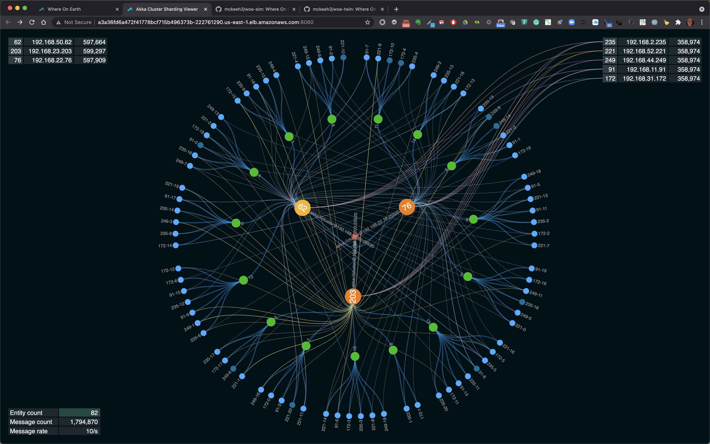
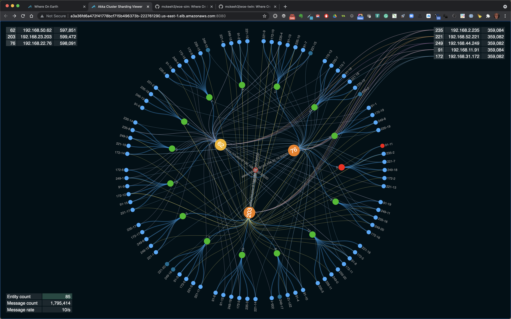
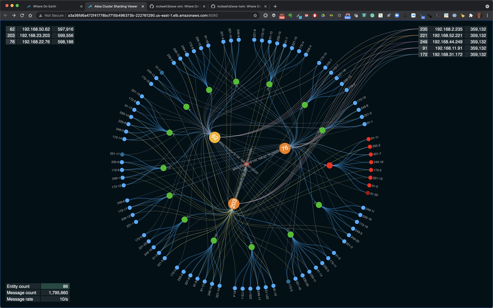
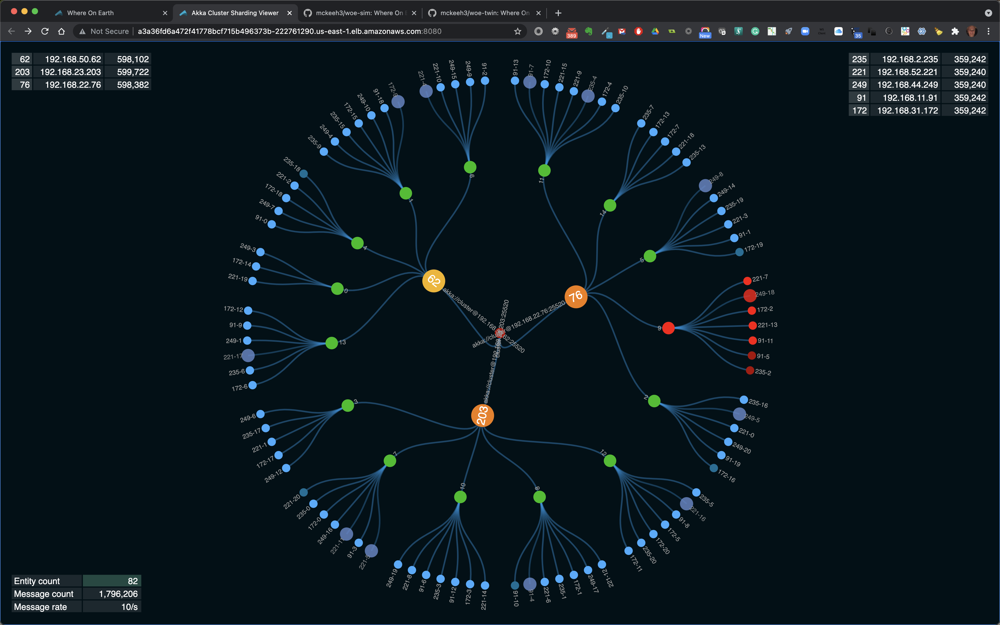
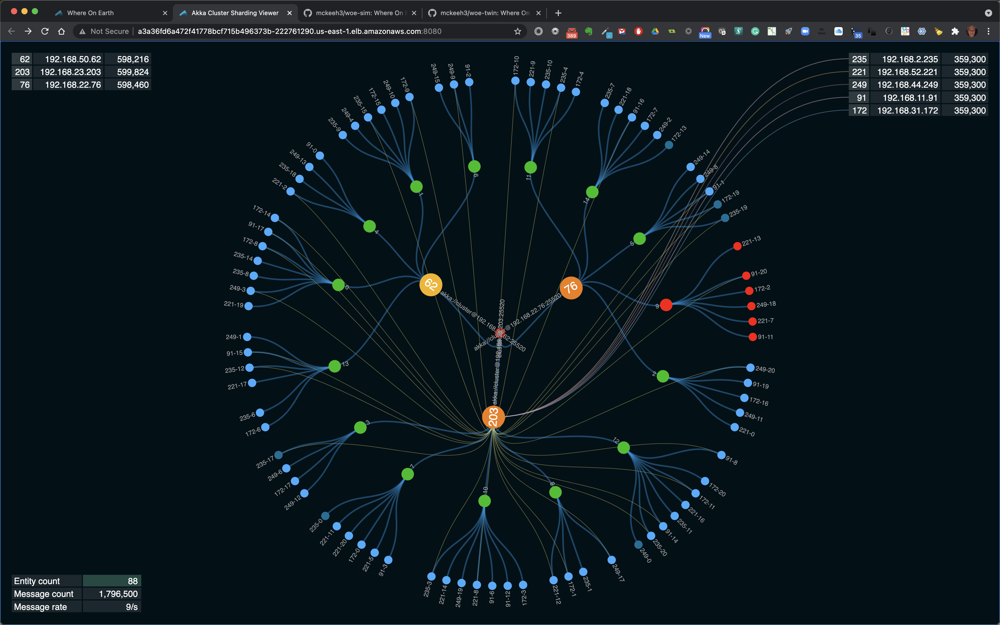

# Akka Cluster Kubernetes Visualizer

A demonstration of a basic Akka Cluster running on Kubernetes with web visualizer.

## Installation

[Minikube](https://github.com/mckeeh3/akka-cluster-kubernetes-visualizer/blob/main/README-minikube.md)

[Red Hat Code Ready Containers](https://github.com/mckeeh3/akka-cluster-kubernetes-visualizer/blob/main/README-redhat-crc.md)

[Amazon EKS](https://github.com/mckeeh3/akka-cluster-kubernetes-visualizer/blob/main/README-amazon-eks.md)

## The Visualizer UI

The visualizer UI shows the details of a running [Akka Cluster](https://doc.akka.io/docs/akka/current/typed/cluster.html). The circles shown in the UI represent
[Cluster Sharding](https://doc.akka.io/docs/akka/current/typed/cluster-sharding.html) actors and cluster nodes.

The above screenshot shows a running Akka Cluster.

### Large Circles

In the diagram at the center of the UI are three different types of circles.
The small red center circle represents a single Akka Cluster.
The large circles out from the center represent multiple things. First, they represent cluster nodes. They also represent HTTP server end-points.
Each of these large circles represent a single JVM. In each node/JVM there are node specific actors, such as shard region actors.

Note that one of the large circles is slightly lighter than the others. This indicates that your browser is accessing this specific node.
Use this when triggering node failures. When demonstrating node failures, it is best to not stop this node because when the node stops the screen
will go blank for a few seconds until the browser is routed to one of the other active ndoes.

### Green Circles

The green circles represent shard actors. There are a fix/configurable number of shard actors regardless on the number of cluster nodes.
These shard actors are the parents of their associated child entity actors (described below).
As the number of cluster nodes scales up and down, the shard actors and their associated entity actors are redistributed across the cluster.
The shard actors are used to evenly distribute entity actors across the cluster nodes.

### Entity Actors

The blue circles on the perimeter represent live entity actors. Entity actors are typically persistent objects. In this demo, the entity actors
do not store their state in a database. As the demo runs you will see entity actors come and go. That is, entity actors are activated because
they received a message, and deactivated/passivated because they have not received a message for a while. This demonstrates how each entity actor
instance remains active in memory only while they are actively processing messages.

## Tracking Specific Actors

In the above screenshot there is an entity actor and its parent shard actor shown in red. This is used to track the movement of specific actors
when the ndoes in the cluster changes.

To track a single entity actor and its associated parent shard actor, mouse over it and single click. Click again toggles of the red highlighting.

Click a shard actor toggles on or off the red highlighting of specific shard actors and all of their associated child entity actors.

## Trigger Akka Cluster Node Failures

You can watch how a running Akka Cluster reacts to a node failure via this UI. To stop a node, click one of the node listed in the top left of the UI.
The top left shows each node's IP and the number of entity messages that have been processed by the entities running on that node.
The number before the IP is the last number in the IP. Note that this number is shown in each of the large circles.

## Message Tracing Visualization

In the above screenshots, shown are lines flowing in from the top left into each of the three large Akka Cluster node circles.
These lines show incoming HTTP requests that are coming in from the simulator microservice.
The simulator microservice periodically sends HTTP requests to specific entities.
These incoming HTTP requests are handles by an Akka HTTP server. Each request is processed as an actor message to an entity actor.
The lines flowing from the large circles to specific entity actors shows these entity messages.

## Toggle Tracing Lines On and Off

The above screenshot is not showing any of the tracing lines. Turn off these tracing lines by single clicking one of the large circles.
Click a large circle again to toggle on the tracing lines.

This screenshot shows tracing lines for a single node.

## Scaling the Cluster

Use the Kubernetes CLI or dashboard to scale the cluster nodes up and down. Changes in the number of nodes will be visualized in the UI
as these changes occur. There is typically a delay between the time you submit the cluster scale changes and when these changes will
appear in the UI.

~~~bash
kubectl scale deployment/visualizer -n visualizer --replicas 3
~~~

~~~bash
kubectl scale deployment/simulator -n simulator --replicas 5
~~~

Scaling the number of simulator nodes increases or decreases the rate of HTTP requests and the number of active entities in the visualizer microservice.
The current entity count, total cluster entity message count, and the current entity message rate is shown in the bottom left of the UI.
